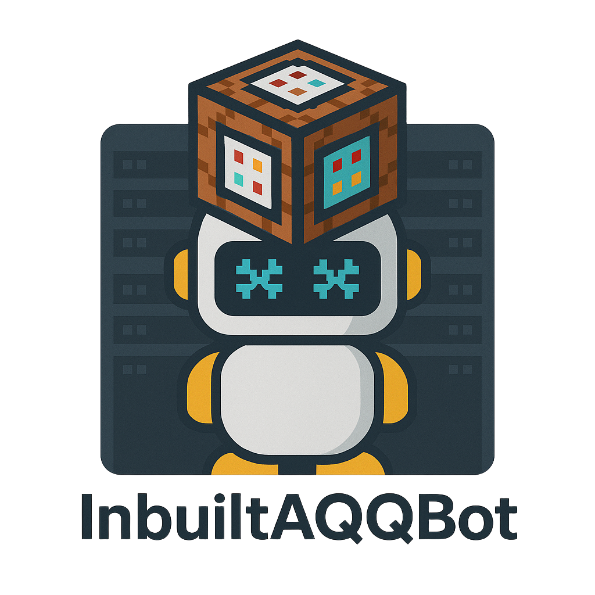

# InbuiltAQQBot

[English](./README.md) | 简体中文

## 介绍

**InbuiltAQQBot** 是一个 Minecraft 插件. 它会在启动时**自动下载并启动** Lagrange.OneBot 框架. 只需配置 Lagrange.OneBot 即可在各种服务器上轻松部署 OneBot v11 框架, **包括像 `simpfun.cn` 这样严格受限的面板服务器**. 

## 特点
- **自动部署 & 增强兼容性:** 自动下载并运行 Lagrange.OneBot, 无需手动设置. 提供与面板托管服务器的卓越兼容性, 尤其是在权限受限的环境中. 
- **轻量设计:** 插件本身非常轻量, 仅约 4.5MB. 
- **简单配置:** 插件本身无需配置——只需设置 Lagrange.OneBot 即可获得用户友好的体验. 

## 使用

1.  **安装 & 启动:** 将插件放入 Minecraft 服务器的 `plugins` 文件夹并启动服务器. 
2.  **配置框架:** 停止服务器. 编辑 Lagrange.OneBot 的配置文件: `plugins/InbuiltAQQBot/Lagrange/appsettings.json`. 
3.  **扫码登录:** 重启服务器. 在 `plugins/InbuiltAQQBot/Lagrange` 目录中找到生成的 `.png` 二维码文件. 使用您的 QQ 机器人账号扫描此二维码登录. 
4.  **完成:** 成功登录后, QQ 机器人框架即可使用. 

## 许可证
本插件基于 LGPL-2.1 协议开源, 请遵守该协议, 最终解释权归 *alazeprt* 所有. 